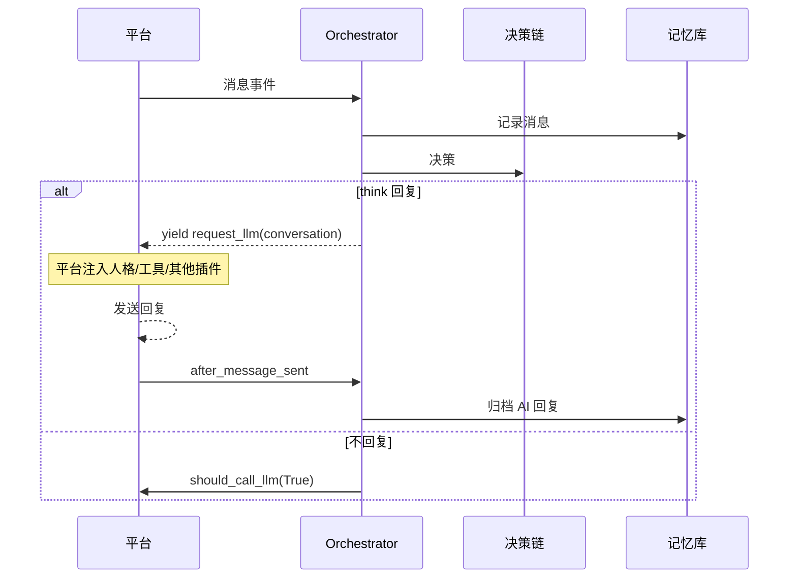

# 拟人对话 (AI Companion)

> 让 AI 像真人一样聊天：**自己决定要不要接话**，而不只是被动应答。

一个以「人」为模型重构的 AstrBot 聊天插件。群聊与私聊统一抽象，AI 在每一轮
自主判断「这条消息我想不想回」，并为后续的主动发言、长期记忆、关系图谱与
专门决策模型预留了扩展位。

---

## 设计取向

与「自建整条上下文链路」类插件不同，本插件复用平台原生 Agent 链路：

| 关注点 | 方案 |
|--------|------|
| 人格 / Skills / 工具 / 其他插件注入 | **复用平台**（`event.request_llm`），零成本获得 |
| 「要不要回」 | **自建可插拔决策链**（本插件的核心） |
| 短期对话历史 | 复用平台 conversation |
| 长期记忆 / 检索 | 自建 SQLite（FTS5 trigram 中文检索） |
| 提示词 | 精简：只补人格与临时环境信息，不堆砌规则 |

这样既拿到自主决策能力，又不必重造平台已经做好的部分。

---

## 已实现（P0）

- **统一群聊 / 私聊**：一个入口处理所有会话，决策链内部区分场景。
- **回复决策链**（可插拔，按成本从低到高短路）：
  1. `HardFilterDecider` — 空消息 / 指令 / Bot 自身消息 / 未启用会话
  2. `RuleDecider` — 私聊、被 @、被引用、唤醒前缀 → 直接回复
  3. `RateLimitDecider` — 最小回复间隔、冷却
  4. `ProbabilityDecider` — 基础概率（未来替换为专门决策模型处）
- **每会话运行态注册表**：同时关注 N 个窗口，内存开销 ~1KB/会话，
  **不 per-window 常驻 Agent**；同会话串行（锁），跨会话并行。
- **全量消息落库**：即使 AI 决定不回复也会记录（真人也记得别人说过的话）。
- **中文历史检索**：SQLite + FTS5 `trigram`；2 字符短词自动回退 `LIKE`。
- **LLM 工具**：`search_chat_history`，模型需要时可自行翻聊天记录。
- **指令**：`/companion_status`、`/companion_search <关键词>`。

---

## 安装

```bash
# 放入 AstrBot 插件目录
cp -r astrbot_plugin_ai_companion /path/to/AstrBot/data/plugins/
# 重载插件（或重启 AstrBot）
```

无第三方运行时依赖（数据库用标准库 `sqlite3`）。

---

## 配置

| 配置项 | 默认 | 说明 |
|--------|------|------|
| `enable` | true | 总开关 |
| `enable_private_chat` | true | 私聊 |
| `enable_group_chat` | true | 群聊 |
| `reply_probability` | 0.85 | 基础回复概率（0~1） |
| `ignore_command_messages` | true | 指令消息交给平台指令链路 |
| `min_reply_interval_seconds` | 3 | 同会话最小回复间隔 |
| `record_all_messages` | true | 记录全部消息 |
| `system_prompt_extra` | "" | 额外系统提示词（建议精简） |
| `inject_time` | true | 注入当前时间（临时块，不入历史） |
| `debug_mode` | false | 输出每层决策结果 |

**注意**：本插件与 AstrBot 平台自带的「主动回复」功能定位不同（后者是消息触发，
本插件是自主判断），无需额外关闭；但本插件接管了回复决策，若同时使用其他
「主动回复/主动对话」类插件，请避免在同一会话重复配置。

---

## 架构

```
main.py                    入口：注册钩子、组装依赖
core/
  config.py                配置强类型视图
  registry.py              每会话运行态（锁 / 时间戳 / 未回复计数）
  orchestrator.py          记录 → 决策 → 生成/拦截 → 归档
decision/
  base.py                  ReplyDecider 协议 + TurnContext/Decision
  chain.py                 策略链（短路即停）
  filters.py / rules.py / rate_limit.py / probability.py
  llm_judge.py             LLM 读空气（P1 启用）
  plugins/                 专门决策模型插槽（Jev 等）
context/
  renderer.py              消息链 → 可读文本
  assembler.py             动态上下文块（临时、不污染历史）
storage/
  db.py                    SQLite 门面
  schema.sql               表结构（messages/profiles/relations/events）
tools/
  history_search.py        search_chat_history 工具
```

### 数据流



---

## 存储

数据目录：`data/plugin_data/astrbot_plugin_ai_companion/companion.db`

| 表 | 用途 | 状态 |
|----|------|------|
| `messages` (+ `messages_fts`) | 原始消息 + 中文全文检索 | ✅ 已用 |
| `profiles` / `entity_aliases` | 人物画像与别名归一 | 🧱 已建表，待接线 |
| `relations` | 人与人的关系（姐妹/恋人…） | 🧱 已建表，待接线 |
| `events` / `event_participants` | 事件记忆（超边） | 🧱 已建表，待接线 |

---

## 路线图

| 期 | 内容 | 状态 |
|----|------|------|
| P0 | 决策链 / 注册表 / 落库 / 检索工具 | ✅ 已完成 |
| P1 | LLM 读空气接入策略链 | 代码就绪（`llm_judge.py`），待接线 |
| P2 | 短期记忆 compact（窗口不足时压缩沉淀） | 规划中 |
| P3 | 主动消息（全局扫描 + 沉默触发 + 免打扰） | 规划中 |
| P4 | 人物画像与关系图谱（`lookup_person` 工具） | 表已建 |
| P5 | 事件线抽取与关系派生 | 表已建 |
| P6 | 拟人增强（打字延迟 / 错字 / 表情包 / 分段） | 规划中 |
| P7 | 人格面板 / 好感度 / 专门决策模型插槽 | 插槽已预留 |

---

## 开发

```bash
# 需要 AstrBot 源码在 PYTHONPATH 上
PYTHONPATH=/path/to/AstrBot python -m pytest tests/ -q
```

---

## 许可

AGPL-3.0
